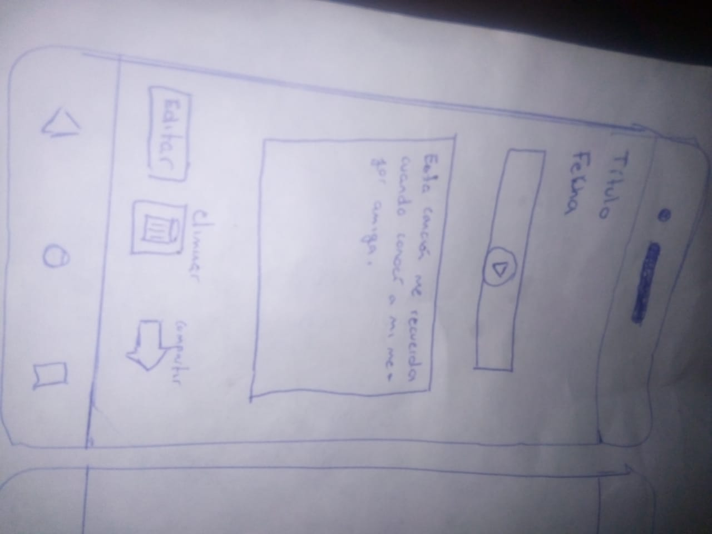
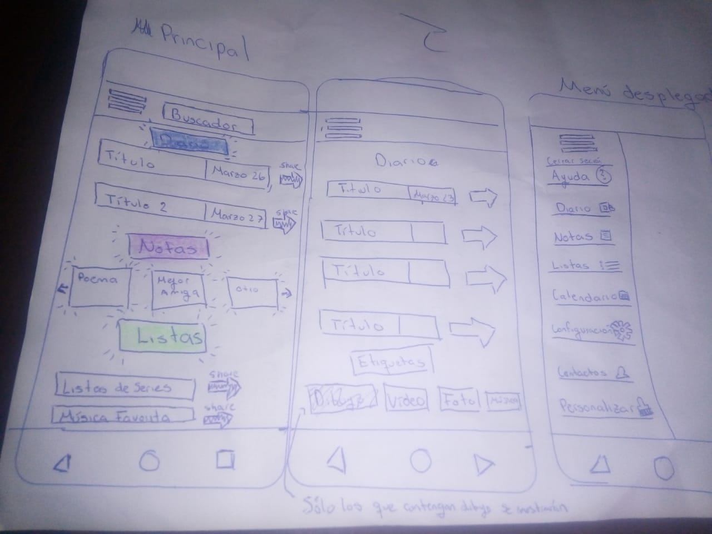
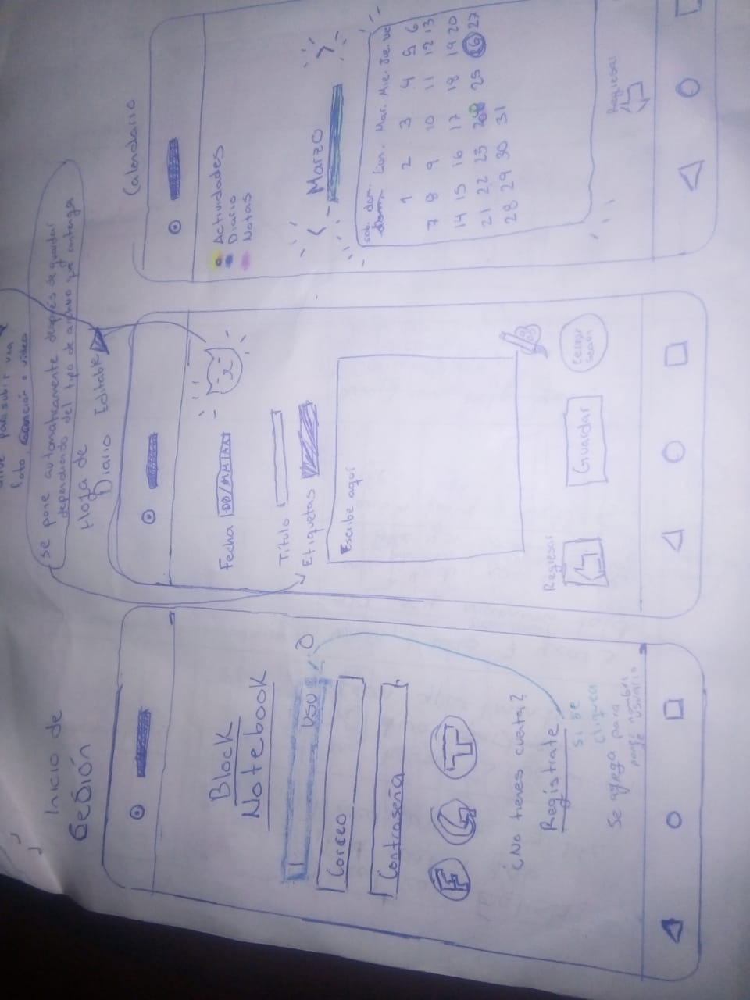

# Block Notebook

## Preámbulo

React, Angular y Vue son algunos de los frameworks y librerías de JavaScript más utilizados por lxs desarrolladorxs alrededor del mundo, y hay una razón para eso. En el contexto del navegador, mantener la interfaz sincronizada con el estado es difícil. Al elegir un framework o librería para nuestra interfaz, nos apoyamos en una serie de convenciones e implementaciones probadas y documentadas para resolver un problema común a toda interfaz web. Esto nos permite concentrarnos mejor (dedicar más tiempo) en las caractrísticas específicas de nuestra aplicación.

Cuando elegimos una de estas tecnologías no solo importamos un pedacito de código para reusarlo, si no que adoptamos una arquitectura, una serie de principios de diseño, un paradigma, unas abstracciones, un vocabulario, una comunidad, etc...

Como desarrolladora Front-end, estos kits de desarrollo pueden resultarte de gran ayuda para implementar rápidamente características de los proyectos en los que trabajes.

## Introducción

Siempre estamos escribiendo, ya sea para recordar algo que nos paso en el día, escribir algo que luego queremos busacar, para desahogarnos, étcetera; y hay algunas veces en las que deseamos compartir lo que escribimos pero perdemos o olvidamos dónde lo pusimos o no las tenemos al alcance de nuestras manos cuando lo necesitamos.

En la actualidad, hay muchas personas que cuentan con algún dispositivo, ya sea un móvil, una tablet o una computadora, es por eso que crearé una app para dispositivo móvil adaptable a otros dispositivos en la que el usuario pueda escribir, dibujar, subir foto, una canción o un vídeo y lo pueda compartir con el contacto seleccionado el cual, también cuente con la aplicación.

Se puede escribir como una nota, una lista o como un diario.  

## Objetivos de aprendizaje

Los objetivos seran aprender...

* [ ] React
* [ ] Qué es React
* [ ] ReactDOM rendering
* [ ] Que es un React component
* [ ] JSX
* [ ] State and setState
* [ ] Manejo de eventos
* [ ] Props
* [ ] Refs
* [ ] Lifecycle Methods
* [ ] React-router
* [ ] Route Config
* [ ] Links
* [ ] URL Parametros
* [ ] Navegación programatica
* [ ] Rutas protegidas
* [ ] Redirect

### Objetivos de aprendizajes pendientes

### CSS

* [ ] [CSS `flexbox`](https://css-tricks.com/snippets/css/a-guide-to-flexbox/)  
* [ ] [CSS `grid layout`](https://css-tricks.com/snippets/css/complete-guide-grid/)  
* [ ] [Construir tu aplicación respetando el diseño realizado](maquetación).

### Javascript

* [ ] [Uso de callbacks](https://developer.mozilla.org/es/docs/Glossary/Callback_function)
* [ ] [Consumo de Promesas](https://scotch.io/tutorials/javascript-promises-for-dummies#toc-consuming-promises)

### Firebase

* [ ] [Firestore](https://firebase.google.com/docs/firestore)
* [ ] [Firebase security rules](https://firebase.google.com/docs/rules)
* [ ] [Uso de onSnapshot](https://firebase.google.com/docs/firestore/query-data/listen)
* [ ] [onAuthStateChanged](https://firebase.google.com/docs/auth/web/start#set_an_authentication_state_observer_and_get_user_data)

### Testing

* [ ] [Testeo asíncrono](https://jestjs.io/docs/es-ES/asynchronous)
* [ ] [Mocking](https://jestjs.io/docs/es-ES/manual-mocks)

### Planificación

* [ ] Escribir las **Definiciones de terminado** y **Criterios de Aceptación** por cada **Historia de usuario**  
* [ ] Projects
* [ ] Commits más seguido

### Buenas prácticas de desarrollo

* [ ] Modularización
* [ ] Nomenclatura / Semántica
* [ ] Respetar reglas del linting

***

## Consideraciones Generales

Se hará un proyecto con MVC Y SPA
Se debe utilizar React.js, react-router y Promises.
Se hará en 3 semanas.

## Avances esperados

Historias de usuario
Una vez que entiendas las necesidades de tus usuarios, escribe las Historias de Usuario que representen todo lo que el usuario necesita hacer/ver. Las Historias de Usuario deben ser el resultado de tu proceso de entendimiento de tus usuarios.

Asegúrate de incluir la definición de terminado (definition of done) y los Criterios de Aceptación para cada una.

En la medida de lo posible, termina de construir una historia de usuario antes de pasar a la siguiente (Cumple con Definición de Terminado + Criterios de Aceptación).

Diseño de la Interfaz de Usuario
Prototipo de baja fidelidad
Durante tu trabajo deberás haber hecho e iterado bocetos (sketches) de tu solución usando papel y lápiz. Te recomendamos tomar fotos de todas las iteraciones que hagas, que las subas a tu repositorio y las menciones en tu README.md.

Prototipo de alta fidelidad
Lo siguiente es diseñar tu Interfaz de Usuario (UI por sus siglas en inglés - User Interface). Para eso debes aprender a utilizar alguna herramienta de diseño visual. Nosotros te recomendamos Figma que es una herramienta que funciona en el navegador y, además, puedes crear una cuenta gratis. Sin embargo, eres libre de utilizar otros editores gráficos como Illustrator, Photoshop, PowerPoint, Keynote, etc. Recuerda utilizar la identidad gráfica correspondiente a cada set de datos que elijas.

El diseño debe representar el ideal de tu solución. Digamos que es lo que desearías implementar si tuvieras tiempo ilimitado para trabajar. Además, tu diseño debe seguir los fundamentos de visual design.

Testeos de usabilidad
Durante el reto deberás hacer tests de usabilidad con distintos usuarios, y en base a los resultados, deberás iterar tus diseños. Cuéntanos qué problemas de usabilidad detectaste a través de los tests y cómo los mejoraste en tu propuesta final.

## Hacker Edition

* [ ] Buscador por nombre, etiqueta o tipo.
* [ ] Poder subir y visuavilizar imágen.
* [ ] Poder subir y visuavilizar música.
* [ ] Poder subir y visuavilizar vídeo.
* [ ] Personalización de la aplicación por el usuario (fondo, ícono, color)
* [ ] Calendario para ver las notas, el diario por la fecha.
* [ ] Poder dibujar en la app parecido a paint.

